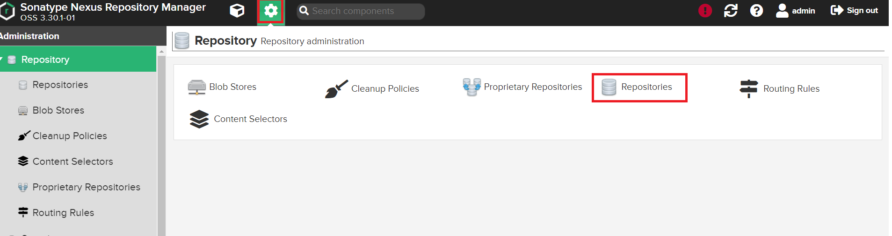
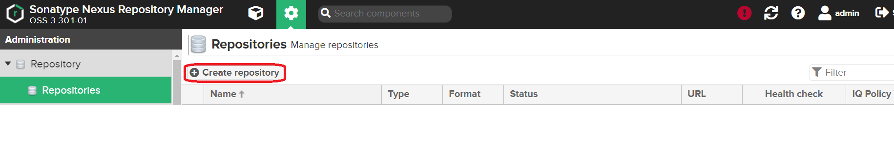
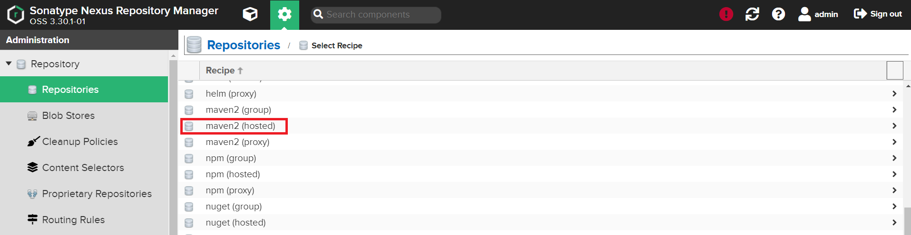
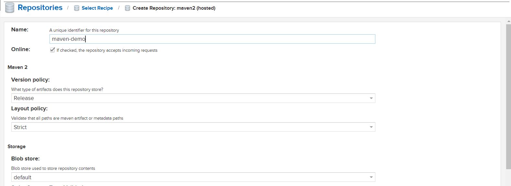

### Steps:
1. Login to your Linux VM and [Install docker](https://github.com/submah/docker-tutorials/blob/master/docker-installation.md)
2. We are going to launch nexus through docker image. Execute the below commands to access nexus UI

```sh
# Create a docker volume

docker volume create local-nexus-data

#Create Nexus Docker Container

docker run -d -p 8081:8081 --name nexus -v local-nexus-data:/nexus-data sonatype/nexus3

```
3. To access nexus UI, Navigate to **IP-address-of-Host_VM:8081**

4.	Login to nexus as admin

    * IP-address-of-Host-VM:8081 

    * Login with username as **admin** and to get **password** navigate to docker volume 
    <table><tr><td>cat /var/lib/docker/volumes/local-nexus-data/_data/admin.password</tr></td></table>

5.	Create repository **maven-demo** and **maven-demo-snapshots**










6.	Clone the sample java project

    * git clone https://github.com/submah/maven-helloworld.git

Note: Delete the existing pom.xml file and create a new pom.xml file with below contents

```xml
<project xmlns="http://maven.apache.org/POM/4.0.0" xmlns:xsi="http://www.w3.org/2001/XMLSchema-instance"
        xsi:schemaLocation="http://maven.apache.org/POM/4.0.0 http://maven.apache.org/xsd/maven-4.0.0.xsd">
        <modelVersion>4.0.0</modelVersion>
        <groupId>com.efsavage</groupId>
        <artifactId>hello-world-war</artifactId>
        <version>1.0.4-SNAPSHOT</version>
        <packaging>war</packaging>
        <name>Hello World Web Application Repository</name>
        <description>Simplest possible Java Webapp</description>

    <distributionManagement>
     <snapshotRepository>
      <id>maven-demo-snapshots</id>
      <url>http://PROVIDE-NEXUS-SERVER-IP:8081/repository/maven-demo-snapshots/</url>
    </snapshotRepository>


      <repository>
        <id>maven-demo</id>
        <name>maven-demo</name>
        <url>http://PROVIDE-NEXUS-SERVER-IP:8081/repository/maven-demo/</url>
      </repository>

  </distributionManagement>

        <build>
                <plugins>


                        <plugin>
                                <groupId>org.mortbay.jetty</groupId>
                                <artifactId>jetty-maven-plugin</artifactId>
                                <version>8.1.5.v20120716</version>
                                <configuration>
                                        <scanIntervalSeconds>0</scanIntervalSeconds>
                                </configuration>
                        </plugin>
                        <plugin>
                                <groupId>org.apache.maven.plugins</groupId>
                                <artifactId>maven-war-plugin</artifactId>
                                <version>2.1.1</version>
                        </plugin>
                        <plugin>
                                <groupId>org.apache.maven.plugins</groupId>
                                <artifactId>maven-release-plugin</artifactId>
                                <version>2.5.1</version>
                                <configuration>
                                <tagNameFormat>v@{project.version}</tagNameFormat>
                                <autoVersionSubmodules>true</autoVersionSubmodules>
                                </configuration>
                        </plugin>
                </plugins>
        </build>
</project>
```

7.	Now we must create a directory **.m2** under **/root**

    * mkdir    ~/.m2

8.	Now create **settings.xml** file and copy the below code

    * File: ~/.m2/settings.xml

```xml
<settings xmlns="http://maven.apache.org/SETTINGS/1.1.0"
  xmlns:xsi="http://www.w3.org/2001/XMLSchema-instance"
  xsi:schemaLocation="http://maven.apache.org/SETTINGS/1.1.0 http://maven.apache.org/xsd/settings-1.1.0.xsd">

<servers>
   <server>
      <id>maven-demo-snapshots</id>
      <username>PROVIDE-NEXUS-USERNAME</username>
      <password>PROVIDE-NEXUS-PASSWORD</password>
    </server>

    <server>
      <id>maven-demo</id>
      <username>PROVIDE-NEXUS-USERNAME</username>
      <password>PROVIDE-NEXUS-PASSWORD</password>
    </server>

  </servers>

<profiles>
 <profile>
   <id>release</id>
   <repositories>
      <repository>
        <snapshots>
          <enabled>false</enabled>
        </snapshots>
        <id>maven-demo</id>
        <name>maven-demo</name>
        <url>http://PROVIDE-NEXUS-SERVER-IP:8081/repository/maven-demo/</url>
      </repository>
    </repositories>
    <activation>
      <activeByDefault>true</activeByDefault>
    </activation>
  </profile>

 <profile>
   <id>snapshot</id>
   <repositories>
      <repository>
        <snapshots>
          <enabled>true</enabled>
        </snapshots>
        <id>maven-demo-snapshots</id>
        <name>maven-demo-snapshots</name>
        <url>http://PROVIDE-NEXUS-SERVER-IP:8081/repository/maven-demo-snapshots/</url>
      </repository>
    </repositories>
    <activation>
      <activeByDefault>true</activeByDefault>
    </activation>
  </profile>
</profiles>


  <mirrors>
    <mirror>
      <id>maven-public</id>
      <name>maven-public</name>
      <url>http://PROVIDE-NEXUS-SERVER-IP:8081/repository/maven-public/</url>
      <mirrorOf>*</mirrorOf>
    </mirror>
  </mirrors>

</settings>

```
