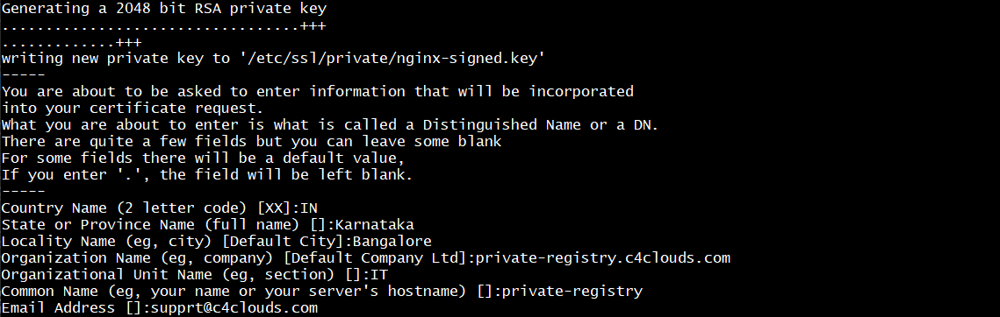

### Steps:

1. Login to you CentOS 7 VM and [Install docker](https://github.com/submah/docker-tutorials/edit/master/install_docker_centos7.md).

2. Create the SSL Certificate

TLS/SSL works by using a combination of a public certificate (.crt) and a private key (.key). The SSL key is kept secret on the server. It is used to encrypt content sent to clients. The SSL certificate is publicly shared with anyone requesting the content. It can be used to decrypt the content signed by the associated SSL key. You should already have the directories **/etc/ssl/certs** and **/etc/ssl/private** to hold the certificates. If not, you have to create them and be able to write to them.

Now, we can create a self-signed key and certificate pair with OpenSSL in a single command by typing:

```
openssl req -x509 -nodes -days 365 -newkey rsa:2048 -keyout /etc/ssl/private/nginx-signed.key -out /etc/ssl/certs/nginx-signed.crt

```


3. Pull the Nexus Docker Container 

```
docker pull sonatype/nexus3

```

4. Create a Nexus Docker Container

```
# Create a docker volume

docker volume create local-nexus-data

docker run -d -p 8081:8081 -p 4000:4000 --name nexus -v local-nexus-data:/nexus-data sonatype/nexus3

```
5. Create an NGINX Proxy Container

File: nginx.conf

```java
user  nginx;
  worker_processes  1;

  error_log  /var/log/nginx/error.log warn;
  pid        /var/run/nginx.pid;

   events {
      worker_connections  1024;
    }

    http {

    log_format  main  '$remote_addr - $remote_user [$time_local] "$request" '
                      '$status $body_bytes_sent "$http_referer" '
                      '"$http_user_agent" "$http_x_forwarded_for"';

    access_log  /var/log/nginx/access.log  main;

    proxy_send_timeout 120;
    proxy_read_timeout 300;
    proxy_buffering    off;
    keepalive_timeout  5 5;
    tcp_nodelay        on;

    server {
        listen         80;
        server_name    private-registry.c4clouds.com;

	return         301 https://$server_name$request_uri;
    }

    server {
        listen   *:443 ssl;
        server_name  private-registry.c4clouds.com;

        # allow large uploads of files - refer to nginx documentation
        client_max_body_size 1024m;

        # optimize downloading files larger than 1G - refer to nginx doc before adjusting
        #proxy_max_temp_file_size 2048m

        ssl on;
        ssl_certificate      /etc/nginx/nginx-signed.crt;
        ssl_certificate_key  /etc/nginx/nginx-signed.key;

        location / {
            proxy_pass http://nexus:8081/;
            proxy_set_header Host $host;
            proxy_set_header X-Real-IP $remote_addr;
            proxy_set_header X-Forwarded-For $proxy_add_x_forwarded_for;
	    proxy_set_header X-Forwarded-Proto "https";
        }
    }
}
```
